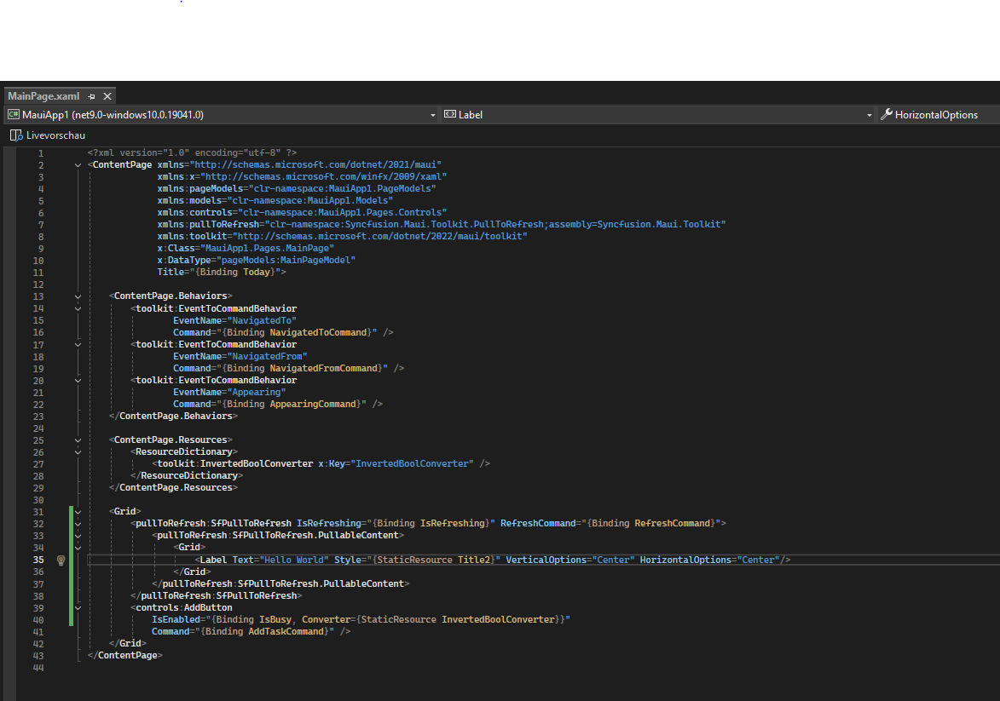

# ArbeitsJournal von FB10 Phase 1 und Phase 5

Da Max, Melvin und Ich beim Rollout in den letzten Monaten helfen mussten, konnten wir nicht am Fachblock Teilnehmen wie der rest der Auszubildenden,  wir bekammen einen spezielllen Auftrag als Reviewer der Apps die die anderen zu reviewen in dem wir sie mittels anleitung installieren und konfigurieren tun.

## Phase 1: Setup & Initialisierung

Als erstes musste ich **[Microsoft Visual Studio](https://dotnet.microsoft.com/en-us/learn/maui/first-app-tutorial/modify)** installieren. Als Volgeaufgabe eine "Hello World "<mark>Maui</mark>" app" kreieren. Da habe ich auch gemäss der Maui-Anleitung herausgefunden welche Datei für Visuelle zuständig ist. 

> Ich hatte probleme mit dem initiallisieren des virtuellen Android Handys. da half mir Porter mit dem problem, er sagte ich brauche Hyper-V an.

Am Code alles unnötige vom grid Weggeworfen bis nur noch ein <mark>label</mark> übrig war da dann "Hello World" hinzugefügt. 

  
  

> Habe viel mit .md gearbeitet bzw. getestet wie, wann, bis wo GFMs limite gehen.
